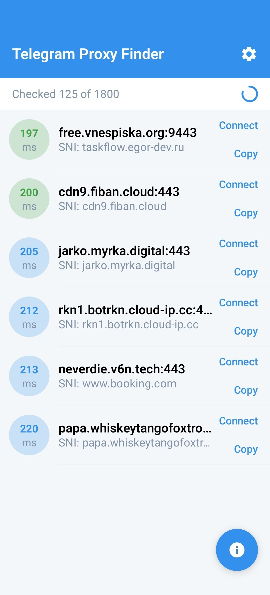
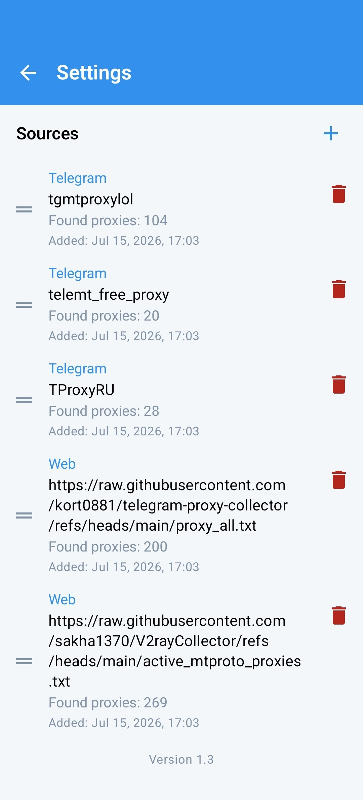
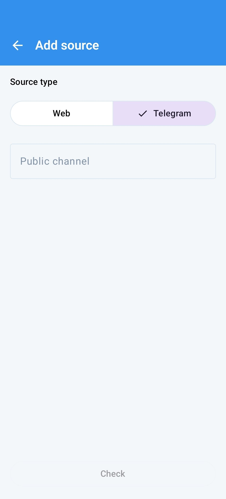

# Telegram Proxy Finder

Русская версия | [English version](./README.md)

---

Android-приложение для поиска рабочих MTProto-прокси для Telegram. Приложение загружает публичные списки прокси и проверяет каждый из них локально с помощью `tdlib`. Благодаря такой проверке вы получаете прокси, которые точно работают в вашей сети.

В **Настройках** можно добавлять собственные источники — публичные Telegram-каналы (`@channel`, `t.me/channel`) или веб-адреса со списками прокси. Источники можно менять местами и удалять.

Последнюю версию можно загрузить в разделе "[Releases](https://github.com/duck-psycho/telegram-proxy-finder/releases)".

## Скриншоты

  
  
  

## Поддержать разработчика

Если приложение оказалось полезным, вы можете поддержать разработчика донатом:

Boosty: https://boosty.to/duckpsycho/donate

BTC (Bitcoin): 178tovsfYQ8omdEPQSHAiH4jXBbBCWNacs

USDT, TRX (TRC20): TLD6QVdHhHNRDgRkYuqhUa2B9bkYgeRxmy

TON: EQDuRyrzSzP8dqbMVNwEBvan_LPK44uRAIuAoT_VF2BXQtS6

ETH (ERC20): 0xF7556e3969e520A677e91E2bFb90EA88bD57EaD9

SOL (Solana): 3tGbXMzqTu7av7DjriY7wkWGEEHxshEZN9SbFP4qBi8v

LTC (Litecoin): LfmZvRPM4zb6EtwnAn9ATLo8kK4Rw7JxUK

BNB: 0xF7556e3969e520A677e91E2bFb90EA88bD57EaD9
